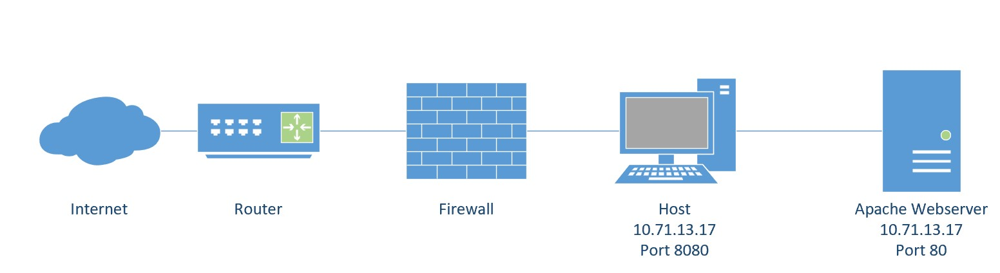
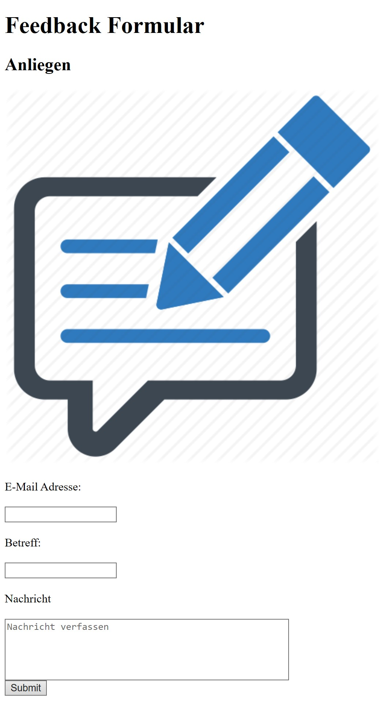
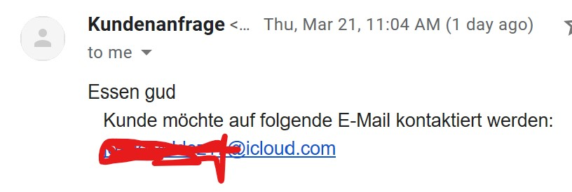

# Modul 300 LB1 - Amauri Valdez

## Inhaltsverzeichnis

- [Modul 300 LB1 - Amauri Valdez](#modul-300-lb1---amauri-valdez)
  - [Inhaltsverzeichnis](#inhaltsverzeichnis)
  - [Tools](#tools)
    - [Virtualbox](#virtualbox)
    - [Vagrant](#vagrant)
    - [Vagrant File](#vagrant-file)
    - [Visualstudio-Code](#visualstudio-code)
    - [Git](#git)
  - [Auftrag](#auftrag)
  - [Service-Beschreibung](#service-beschreibung)
  - [Network-Setup](#network-setup)
  - [Sicherheitsaspekte](#sicherheitsaspekte)
  - [Webserver-Konfiguration](#webserver-konfiguration)
  - [Index](#index)
  - [sendmail.php](#sendmailphp)
  - [dir.conf](#dirconf)
  - [Installation](#installation)
- [Test-Cases](#test-cases)
- [Persönliche-Lernentwicklung](#pers%C3%B6nliche-lernentwicklung)
- [Endprodukt](#endprodukt)

## Tools

Folgende Tools habe ich für die Installation meiner Umgebung samt VM gebraucht.

### Virtualbox

Wir haben den Hypervisor *VirtualBox* benutzt, um die virtuellen Maschinen zu konfigurieren und die nötigen Pakete zu installieren. 

### Vagrant

Vagrant war die Verwaltungssoftware, die ich gebraucht habe, um die VM's automatisch aufzusetzen. Dies erleichtert die Verwaltung der einzelnen Virtuellen Maschinen, da mit einem sogennanten *Vagrantfile* die Kommandos festgehaltet werden können, die später die Virtuelle Maschine dementsprechend aufsetzten. Dies spart erheblich Zeit, da man nicht alles manuell konfigurieren muss. Vagrant kann auf den Betriebssystemen Linux, Unix, macOS und Windows.

### Vagrant File

Die Vagrantdatei enthält die Konfiguration der Virtuellen Maschine sowie die Befehle für die Installation benötigten Pakete.

### Visualstudio-Code

Visualstudio-Code habe ich genutzt, um die einzelne Files wie meine php, vagrantfile zu editieren und die veränderten Daten auf mein Git Repository zu *pushen*. VisualStudio-Code authentifiziert sich durch mein SSH-Key mit dem sich das Programm auf meinem Git Repository verbindet. Mein Markdown File habe ich ebenfalls im Visualstudio-Code erstellt. Markdown ist nichts anderes als ein Textformatierer.

### Git

Git ist eine Opensource Software die zur Verwaltung von Dateien dient. Um Git lokal benutzen zu können, muss der Git-Client installiert werden, daraufhin wird eine Verbindung mit dem persönlich Git-Repository aufgestellt. Von der Git Bash aus können Repository heruntergeladen werden und lokal ausgeführt werden. Damit dies funktioniert habe ich einen SSH-Key für den Client erstellt der mit Passphrase geschützt ist.


## Auftrag

In diesem Modul lernen wir verschiedene Dienste, Virtualisierungssoftware und Versionierungstool kennen. Mein Auftrag war es einen oder mehrere Dienste auf einer Virtuellen Maschinen (VM) mit Virtualbox aufzusetzen, und die VM samt Dienste anhand des Vagrantfile's zu automatisieren. Das bedeutet, dass ein *Vagrant up* eine funktionstüchtige Umgebung mit ihren Komponenten und Servicen automatisch installieren soll. 

## Service-Beschreibung

Ich habe als Dienst einen Webserver eingerichtet, welcher ein mit php / html betriebenes Web-Formular anzeigt, und eine E-Mail via SSL an den Google Mail Server sendet. Der Benutzer kann seine E-Mail Adresse, Subjekt und den Text angeben, dieser wird anschliessend dem Gmail Konto gesendet. Zusätzlich wird ein Benutzer erstellt der sich auf die VM anmelden kann.


## Network-Setup

```
+------------------------------------------+
! Vom Notebook zum Schulnetz 10.10.x.x     !       
! und localhost 80 --> 8080                !
! Port: 8080                               !	
!                                          !	
!    +-----------------------+             !
!    ! Webserver             !             ! 
!    ! Host: WebserverValdez !             !
!    ! IP: 10.71.13.17       !             !
!    ! Port: 80              !             !
!    ! Nat: 8080             !             !
!    +-----------------------+             !
!                                          !   
+------------------------------------------+
```



Die Umgebungsvariablen die ich gebraucht waren, sind folgende:

```
$mail->Username = 'avocadoguacamole11@gmail.com';
$mail->Password = 'avocguac'; 

```
Diese muss man selber festlegen, damit ich später testen kann, ob das Mail erfolgreich getestet wurde, habe ich mir diese E-Mail erstellt.

Die einzelnen Variablen und Konfigurationsdateien die ich überschreibe, sind nötig damit mein Code/Variablen später korrekt ausgeführt werden und der Service richtig funktioniert.

## Sicherheitsaspekte

Für mehr Sicherheit sorgt der BenutzerLB1, der sudo rechte bekommt und gewisse Services starten und stoppen kann. Die Firewall lässt nur Anfragen von den Ports 22 und 80 durch, andere Anfragen werden abgelehnt. Das Mail wird per TLS versendet und ist somit auch verschlüsselt, was den Inhalt für andere Unlessbar macht. 

```

  sudo ufw --force enable
  sudo ufw default deny incoming
  sudo uwf allow 22/tcp
  sudo ufw allow 80/tcp

echo "Test1234
  Test1234" | adduser BenutzerLB1 --force-badname

  sudo adduser BenutzerLB1 sudo

```


## Webserver-Konfiguration


Die VM wird mit folgenden Einstellungen erzeugt, die Einstellungen wurden natürlich stark vom Netzwerkplan beeinflusst. Zu vermerken ist auch, dass die auf meiner lokalen Maschine angepasste Konfigurationsdateien auf die virtuelle Maschine kopiert wird.

``` Vagrant.configure(2) do |config|

  config.vm.box = "ubuntu/xenial64"

  config.vm.network "forwarded_port", guest:80, host:443, auto_correct: true

  #config.vm.synced_folder ".", "/var/www/html" 
  
  config.vm.define "WebserverValdez"
  
  config.vm.hostname = "WebserverValdez"

  config.vm.provision :file, source: "dir.conf", destination: "/tmp/dir.conf"
  
  config.vm.provision :file, source: "index.php", destination: "/tmp/index.php"
  
  config.vm.provision :file, source: "sendmail.php", destination: "/tmp/sendmail.php"

config.vm.provider "virtualbox" do |vb|

  vb.name = "WebserverValdez"
  
  vb.memory = "1024"  

end
```

## Index 

Die Index Seite der Apache Webseite ist der Index.php, welche mit php code versetzt ist. In dieser Triggered der programmierte Button das sendmail.php, welches anschliessend das E-Mail versendet


## sendmail.php

Beinhaltet den Code, welcher die Email versendet und auf die nächste Webseite weiterleitet.

## dir.conf

Die Dir.conf datei ist zuständig für die Reihenfolge der Webseite, das heisst, der erste Eintrag in dieser Datei, ruft das hinterlegte File als Webseite auf. In meinem Fall wollte ich die php Seite als index festlegen,weil diese meinen nötigen php code beinhaltet. 

```
DirectoryIndex index.php index.html
```

## Installation

Das erste was auf dem Server ausgeführt wird, ist der su Modus um keine Komplikationen bei der Installation zu haben. Darauffolgend wird die installierte Software geupdated. Unser Apache Paket samt Abhängigkeiten werden anschliessend installiert.

```
config.vm.provision "shell", inline: <<-SHELL

 sudo apt-get -y install apache2
  
  sudo apt-get -y install php libapache2-mod-php php-mcrypt php-mysql
  
  sudo systemctl restart apache2
```

Darauffolgend werden die Editierten Konfiguration und Php Dateien vom /tmp/ Verzeichnis in die ihre jeweiligen Verzeichnisse kopiert.  

```
cd /etc/apache2/mods-enabled/
  
  sudo cp /tmp/dir.conf .
  
  chmod 777 dir.conf
  
  cd /var/www/html
```

Damit die Mails später versendet werden können, muss zuerst der phpmailer installiert werden, der die nötigen Komponenten installiert und die Dateien vom /tmp/ in sein Verzeichnis kopiert.

```

  apt install composer -y
  
  composer require phpmailer/phpmailer 

  sudo cp /tmp/index.php .
  
  chmod 777 index.php
  
  sudo cp /tmp/sendmail.php .
  
  chmod 777 sendmail.php
  
  sudo systemctl restart apache2

  SHELL

end

  ```


# Test-Cases


| Testfall        | Soll           | Ist  | Datum |
| ------------- |-------------| -----|----------|
| Webseite ist erreichbar via Port 80 mit Portforwding   | Die Webseite kann vom Lokalen PC aufgerufen werden| Die Webseite ist aufrufbar und der Port 8080 ist aktiv | 20.03.2019|
| E-Mail    | Das E-Mail kann erfolgreich gesendet werden     | Das E-Mail wird erfolgreich in der Inbox angezeigt und der Inhalt des Feedbackformulars ist ersichtlich   | 20.03.2019 |
| E-Mail verschlüsselt | Die E-Mail wird via TLS versendet  |  Der E-Mail parameter TLS ist auf True und E-Mail ist somit verschlüsselt | 20.03.2019 |
| BenutzerLB1 | Der BenutzerLB1 hat root rechte und kann Service neustarten etc. | Der BenutzerLB1 kann den erfolgreich Services neustarten und die Konfigurationsdateien anpassen| 20.03.2019|
| Firewall | Die Firewall Ports 22 und 80 sind geöffnet | Die Firewall öffnet die Ports 22 und 80. Die Firewall ist installiert und öffnet die geforderten Ports. Ufw status eingegeben|20.03.2019 |


# Persönliche-Lernentwicklung

Ich konnte in dieser LB1 viel über Vagrant / Github lernen, da ich zuvor nie in diesen Umgebungen gearbeitet habe. Mir wurde klar wie Github funktioniert und was alles für Aspekte zu beachten sind. Da ich nonie mit VirtualBox gearbeitet habe, hatte ich ziemlich mühe am Anfang zumal auch keine richtige Einleitung gemacht wurde. Ich wurde ins kalte Wasser geworfen und musste mir selber die Informationen suchen, was ich ziemlich anstrengend fand, da ich nicht genau wusste wie Anfangen, weil wir keinen richtigen Input hatten. Trotzdem gelang es mir einen Webserver aufzusetzen und die nötigen Vagrant Commandos ins Vagrantfile zu implementieren. Das Senden des E-Mails konnte ich per TLS senden, dass realisierte ich mit Php, und somit habe ich ein Sicherheitsfeature implementieren können. Ich konnte mich mit meinen Mitschülern austauschen und wir halfen uns so gegenseitig. Letztlich weiss ich nun wie man die ganze Umgebung aufsetzt und wie ein Vagrantfile konfiguriert wird. 

Über Linux wusste ich schon ein paar Sachen da ich schon in einem Unix Team gearbeitet habe. Im Bereich Virtualisierung konnte ich einiges dazu lernen, da ich nur gewohnt war mit Hyper-V zu arbeiten. VirtualBox kannte ich zuvor nicht, jedoch konnte ich mich etwas einleben. Trotzdem fand ich es von der Zeit knapp, damit ich mich umfangreich mit Virtualbox befassen konnte. Vagrant war etwas total neues für mich, aber dank zahlreichen Dokumentationen, konnte ich mir das Wissen aneignen. 


# Endprodukt






